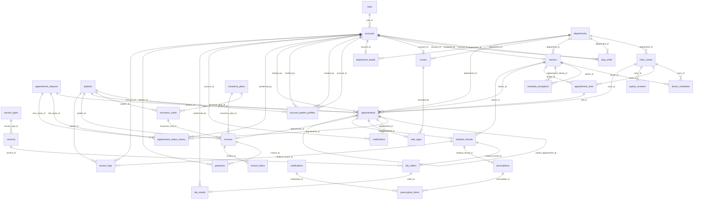

# Sơ đồ thực thể cơ sở dữ liệu (ERD)

```mermaid
erDiagram
    roles ||--o{ accounts : "role_id"
    service_types ||--o{ services : "service_type_id"
    appointment_statuses ||--o{ appointments : "status_id"
    appointment_statuses ||--o{ appointment_status_history : "old_status_id"
    appointment_statuses ||--o{ appointment_status_history : "new_status_id"

    departments ||--o{ clinic_rooms : "department_id"
    departments ||--o{ duty_shifts : "department_id"
    departments ||--o{ doctors : "department_id"
    departments ||--o{ nurses : "department_id"
    departments ||--o{ department_heads : "department_id"
    departments ||--o{ appointments : "department_id"

    accounts ||--o{ duty_shifts : "account_id"
    accounts ||--o{ duty_shifts : "assigned_by"
    accounts ||--o| doctors : "account_id"
    accounts ||--o| nurses : "account_id"
    accounts ||--o| department_heads : "account_id"
    accounts ||--o{ account_patient_profiles : "account_id"
    accounts ||--o{ account_patient_profiles : "created_by"
    accounts ||--o{ account_patient_profiles : "verified_by"
    accounts ||--o{ appointments : "booked_by"
    accounts ||--o{ appointment_status_history : "performed_by"
    accounts ||--o{ notifications : "account_id"
    accounts ||--o{ lab_results : "performed_by"
    accounts ||--o{ payments : "cashier_id"
    accounts ||--o{ access_logs : "account_id"

    patients ||--o{ account_patient_profiles : "patient_id"
    patients ||--o{ insurance_cards : "patient_id"
    patients ||--o{ appointments : "patient_id"
    patients ||--o{ invoices : "patient_id"
    patients ||--o{ access_logs : "patient_id"

    clinic_rooms ||--o{ doctor_schedules : "room_id"
    clinic_rooms ||--o{ appointment_slots : "room_id"
    clinic_rooms ||--o{ queue_counters : "room_id"
    clinic_rooms ||--o{ appointments : "room_id"

    doctors ||--o{ doctor_schedules : "doctor_id"
    doctors ||--o{ schedule_exceptions : "doctor_id"
    doctors ||--o{ schedule_exceptions : "replacement_doctor_id"
    doctors ||--o{ appointment_slots : "doctor_id"
    doctors ||--o{ appointments : "doctor_id"
    doctors ||--o{ medical_records : "doctor_id"

    nurses ||--o{ vital_signs : "recorded_by"

    insurance_plans ||--o{ insurance_cards : "insurance_plan_id"
    insurance_plans ||--o{ invoices : "insurance_plan_id"
    insurance_cards ||--o{ invoices : "insurance_card_id"

    appointment_slots ||--o{ appointments : "slot_id"
    appointments ||--o{ appointments : "parent_appointment_id"
    appointments ||--o{ appointment_status_history : "appointment_id"
    appointments ||--o{ notifications : "appointment_id"
    appointments ||--o| vital_signs : "appointment_id"
    appointments ||--o| medical_records : "appointment_id"
    appointments ||--o| invoices : "appointment_id"

    medical_records ||--o{ lab_orders : "medical_record_id"
    medical_records ||--o{ prescriptions : "medical_record_id"
    medical_records ||--o{ access_logs : "medical_record_id"

    services ||--o{ lab_orders : "service_id"
    lab_orders ||--o| lab_results : "order_id"

    prescriptions ||--o{ prescription_items : "prescription_id"
    medications ||--o{ prescription_items : "medication_id"

    invoices ||--o{ payments : "invoice_id"
    invoices ||--o{ invoice_items : "invoice_id"
```

